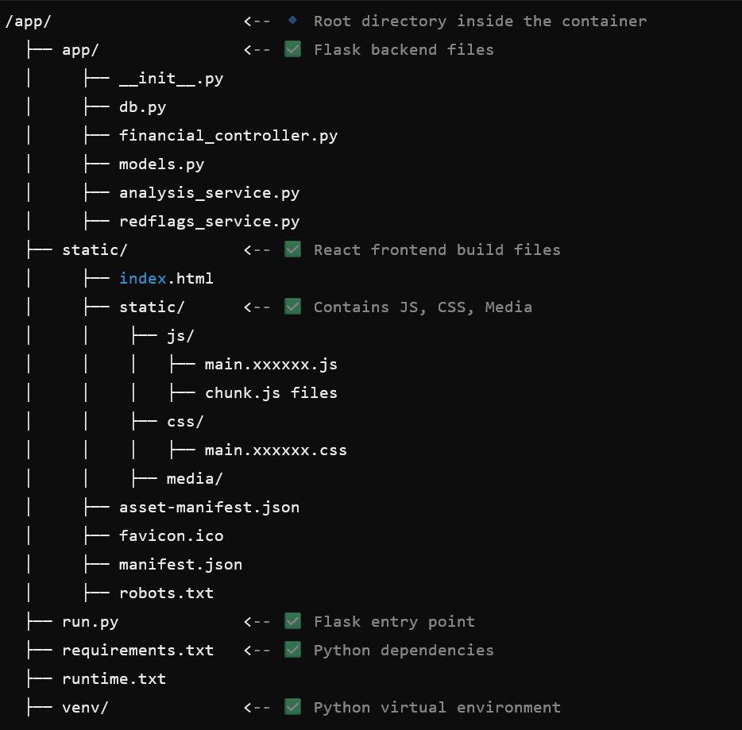

Docker Setup Guide:

1. Download Docker Desktop.

   If you install Docker Desktop, it includes everything you need to build images and run containers, including:
   Docker Engine (for running containers)
   Docker CLI (command-line interface for managing Docker)
   Docker Compose (for multi-container applications)
   A Kubernetes environment (optional)
   A GUI Dashboard (for managing containers and images visually)

   However, here are some additional considerations depending on your use case:

   Windows Users:
   -> Ensure WSL 2 (Windows Subsystem for Linux) is installed and enabled (for better performance).

   Linux Users:
   -> Docker Desktop is not required on Linux. Instead, installing the Docker Engine (docker-ce) is enough.

   Mac Users:
   -> It works natively on macOS (Intel or Apple Silicon).
   -> For Apple Silicon (M1/M2), make sure you're using multi-arch images or emulation.

2. Open Docker Desktop so that Docker Engine keeps running.

2. Open cmd and navigate to root directory of project which contains frontend and backend folders.

3. Create Dockerfile containing multi stage build commands for react front-end and python back-end.

Required Container Directory Structure:

4. (optional) Create docker-compose.yml if planning on adding future service integrations.

5. Run "docker-compose build --no-cache" from root directory of project where Dockerfile is present.

6. Fix any issues in code that might raise exceptions.

7. Once image is built, run container using command "docker-compose up"

8. Navigate the link provided "http://127.0.0.1:5000" to verify if app is accessible.

9. Check if there are any path issues in front-end from Console (In windows: Ctrl + Shift + I)

10. To navigate and run commands inside container -
    docker exec -it company_risk_analysis-web-1 sh     -> Opens an interactive shell (sh) inside the Flask container.
                                                          (here container name -> company_risk_analysis-web-1)
    ls -l /app/static                                  -> Lists files inside /app/static inside the container.
    cat /app/run.py                                    -> Prints the contents of run.py to verify if changes were applied.

11. Troubleshoot paths by confirming whether they are properly configured in run.py, index.html, package.json etc within container. 

Docker Commands -> Purpose

docker-compose build              -> Builds the Docker images based on the Dockerfile.
docker-compose build --no-cache   -> Forces a rebuild without using cache (ensures fresh changes).
docker-compose up                 -> Starts the containers using docker-compose.yml.
docker-compose down               -> Stops and removes all running containers and networks.
docker system prune -a            -> Removes all unused images, containers, and networks to free up space.
docker ps                         -> Lists running containers.
